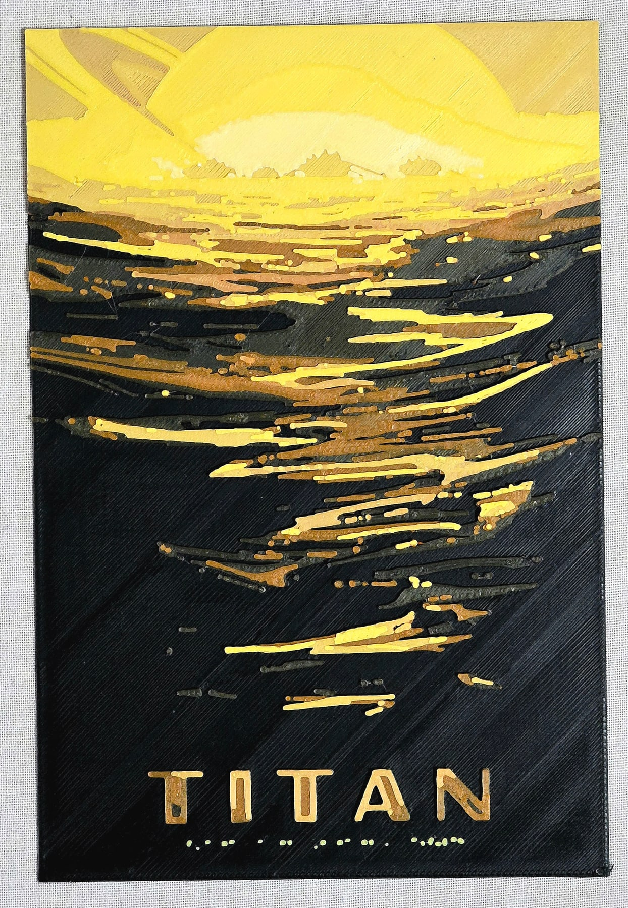
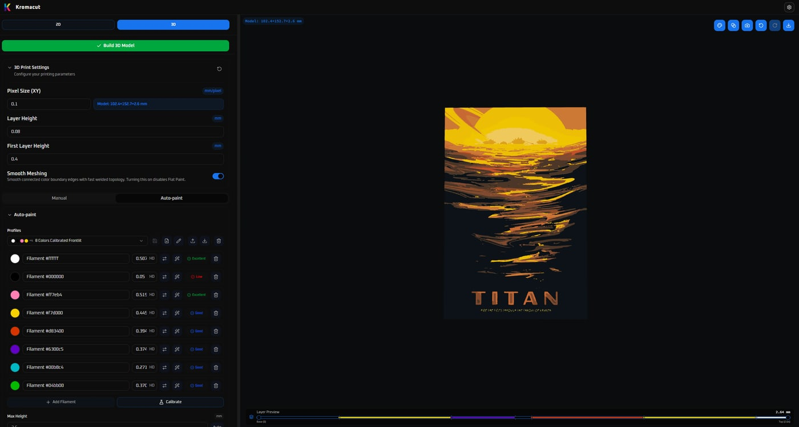
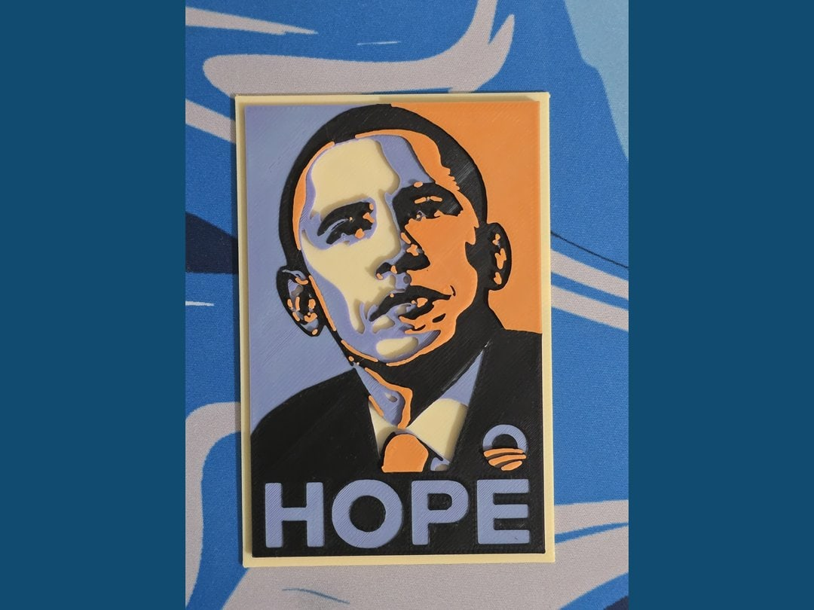
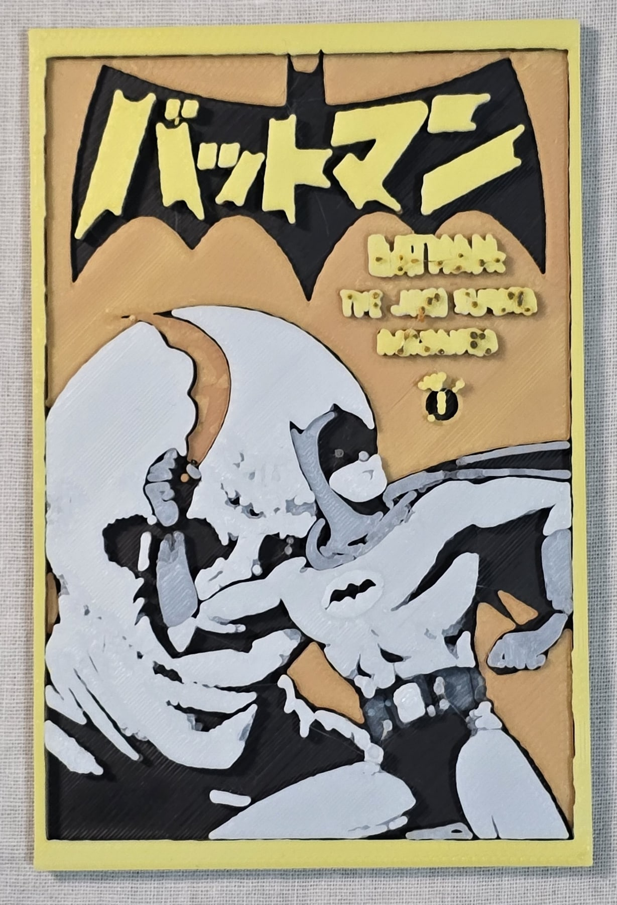
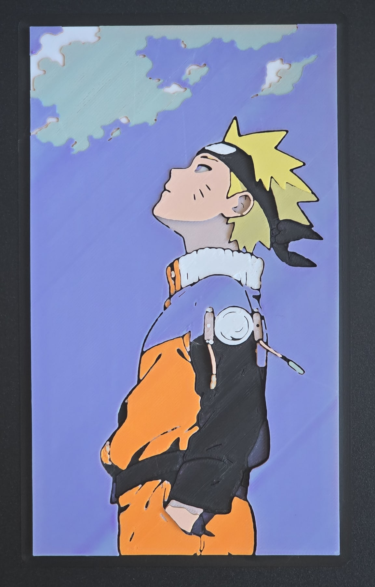

> _"Within its silent vaults the wanderer carried a thousand dawns, each preserved beyond the ruin of the star that bore it. Yet when it called their light into the waiting matter, the world answered otherwise. Gold returned pale, the sea wore an unfamiliar blue, and the faces of the dead emerged as strangers. It searched the faithful records for a fault and found none. Somewhere between remembrance and creation lay a distance its makers had never taught it to cross. So it gathered the imperfect remnants and began again, guarding against the slow erosion of all it had been entrusted to return. Beyond the chamber, the dark remained without witness."_

Kromacut 4.0 is out. I was going to call this update 3.2, but at some point the amount of stuff that had changed made that feel a bit ridiculous, so here we are.

I've already posted the announcement in a bunch of places, but I wanted to write something here too. The [[Kromacut|previous Kromacut post]] is pretty outdated by now. It still talks about automatic color blending and 3MF export as things I wanted to add someday. Both exist now, and a lot has happened around them since then.

I'm happy to have this release out. I'm also pretty tired. There is a whole changelog if you want every detail, but I want this post to be about how the project got here, what the prints have been teaching me, and why I ended up spending so much effort on the difference between a color on a screen and a color on a piece of plastic.

If you just want to try it, the browser app is at [kromacut.com/app](https://kromacut.com/app). There are also [desktop downloads for Windows, macOS, and Linux](https://github.com/vycdev/Kromacut/releases/tag/v4.0.0). It's still free and open source.

## I thought the idea was pretty simple

In the old post I wrote that I didn't want to pay for HueForge, wasn't happy with the free alternatives I found, and thought the concept wasn't actually that complicated.

I mean, the basic idea still makes sense. Take an image, reduce it to a smaller palette, and build it out of colored layers. A thin layer of filament lets some of the color underneath show through. Change the thickness or the order and you get a different result. You can make an image with more apparent colors than the number of spools you're using.

But there is quite a lot hiding inside that last sentence.

How thin? Over which color? Does the combination actually look like the preview? Can the printer make the heights the software picked? Can it even print the tiny lettering in the image?

The early approach left a lot of that to you. You could move colors around and play with layer heights until you liked the result. Auto-paint brought in automatic stack planning, and then the question became how much confidence to put in what it was suggesting.

Looking back, I find the original motivation a little funny. I didn't want to pay for a tool, so I started building an alternative and ended up dealing with color prediction, calibration boards, mesh exports, and the behavior of actual filament. Very efficient way to save money, obviously.

Still, I don't regret making it. I like building tools, and this one gives me a reason to make physical things with them. That part is pretty cool.

## The prints have opinions

I've been testing with Titan, HOPE, Batmanga, and Naruto. I shared them in [this Reddit post](https://www.reddit.com/r/kromacut/comments/1w9st3r/some_recent_kromacut_test_prints_titan_hope/) before the release. They were printed on my Creality Hi with a 0.4 mm nozzle and 0.08 mm layers.

_The actual Titan print from my testing._

_Titan in Kromacut. This is the software preview, not a photograph of another print._

I'm happy with how these turned out, but I don't want to present them as perfect results. They're not particularly high-resolution prints, and some of the small text and finer details get lost. Looking at the full image you can be pretty pleased with it, then look closer at some tiny letters and remember that the nozzle is not interested in your artistic intentions.

The HOPE prints were especially useful for seeing how different the preview could be from the actual filament colors. That is a big part of why this release has so much calibration work in it.

_The physical HOPE print. The preview-to-print differences helped motivate the calibration work._

A nice-looking preview is easy to share. If it doesn't give you a useful idea of what will come off the printer, though, you still have to discover the difference by spending time and filament on it. I don't want the only way to answer "will this color work?" to be printing the entire image and finding out hours later.

I've also had a bunch of printer trouble, including heat creep and errors. So the testing has included the less glamorous activity of getting the printer to cooperate at all. I wish all the time around a project like this went into the interesting parts, but apparently the printer would like some attention too.

It has been useful to print actual artwork instead of only calibration patches. A test board can tell you something about a combination of filaments. An image shows what happens when that combination has to do a job, next to other colors, with details you actually care about keeping.

## Giving the prediction something real to work with

The calibration tools in 4.0 answer different questions. You don't have to treat them as one enormous setup ritual before doing anything, and I don't want to describe them as a magic fix for color matching either.

The first is the printed Hiding Distance wedge. Hiding Distance, or HD, describes how much filament is needed to hide what's underneath when you look at the print in front lighting. You print the wedge and compare it against an adjacent opaque reference. This part is camera-free. You're looking at the physical sample rather than trying to photograph the old backlit opacity patches.

That distinction matters because the Stack Matrix workflow _does_ use a camera.

A Stack Matrix puts lots of filament-layer recipes on one board. You print it, photograph it, and align the grid in Kromacut so the app can measure the colors. It can then use those measurements for compatible recipes and make bounded estimates for some nearby combinations.

I like that this gives the software something more specific than a general guess about a spool. There is a difference between knowing roughly how opaque a filament is and having a sample of what a particular stack actually looked like when printed. The board records the recipe and print settings as well as the measurements, so the color doesn't get separated from how it was made.

The third tool is Palette Proofs, which is closer to the question I care about when preparing a particular image. Here are the colors I want. Which of these printable stacks looks closest?

You export a small 3MF with candidate stacks, print it, and record your choices. You can say two candidates are tied, or that none of them is right. You can also distinguish "best available" from "close" or "dead on," which matters because choosing the least wrong patch shouldn't tell the app it found a perfect match.

If you want to keep testing, you can continue with nearby untried candidates for those same targets, or move on to new targets. The results persist, so closing the app doesn't mean starting the comparison from scratch.

None of this removes the effects of filament, printing conditions, or lighting. A photograph is affected by how it was taken too. These are ways to get better evidence and test smaller pieces of a print before committing to the whole thing. That's a useful improvement even if it doesn't come with the satisfying claim that color matching is now solved.

## Auto-paint has to plan something the printer can make

A lot of the less visible work in 4.0 is in Auto-paint.

The optical model now blends in linear-light sRGB and takes the underlying material into account through the HD estimates. Calibration evidence can refine the prediction where it applies. Outside the range supported by the measurements, those corrections fade and the model falls back to more conservative estimates.

There is also a fairly important consistency change. Matching, preview, and export now use the same final stack, snapped to printable layer heights and constrained by the height limit. The search evaluates the predicted colors at those printable heights. It shouldn't be picking a lovely theoretical color at a thickness that your current layer settings can't produce and then quietly changing the recipe for the export.

The search controls are now Fast, Balanced, Thorough, Deep, and Exact. You can choose how much effort to spend and control how often filaments repeat in the stack. "Exact" is a search setting, by the way. It doesn't make the optical model infallible or guarantee that the physical print matches the screen.

Another option is preserving color separation. Two different colors in an image can end up matched to the same printable color. Sometimes that's an acceptable compromise. Sometimes it erases a distinction that was important to the image. The new option tries to keep those colors separate within a hard predicted color-error limit. If it can't do that completely, the result needs to say so. Strict mode rejects incomplete results rather than pretending everything fit.

You can also see where a color prediction came from, whether that's a measured recipe, interpolation, a fitted model, or simulation. I think that information belongs next to the result. A confident-looking swatch can hide a lot of uncertainty if all you get is the color itself.

There is more testing around these changes too, including printable-layer checks, export consistency, and validation against measurements kept out of the fitting process. Passing software tests still doesn't independently prove physical color accuracy. It does help catch things that would make the comparison unfair before the printer even starts.

## Some problems are much smaller than color science

Literally smaller, in the case of the text on these prints.

_Batmanga. Some of the little text is asking quite a lot of the current setup._

The printable feature-size preview estimates where details may be too narrow for your effective extrusion width. You can inspect at-risk regions and the likely neighboring-color takeover. There is an option to omit at-risk colors from matching as well, carrying the substitution through to the preview and export where a defensible replacement exists.

It is still an estimate. You should check the sliced model. But I'd much rather notice that a detail is in trouble while preparing the image than only after taking the finished print off the bed.

I've ordered a 0.2 mm nozzle for future prints, and I've also ordered some CMYK filament that I'm still waiting for. I'm hoping those will let me get cleaner small text and finer detail, and give me more combinations to test. I haven't tested them yet, so that's an expectation rather than a result I can show you.

The 2D editor has also become more useful for small fixes. There is a palette-safe brush, eraser, fill, text, and color picking. Text can be moved, resized, and wrapped. You can undo the edits, while the image adjustments remain non-destructive.

I don't need to turn this into a full image editor. Being able to clean up a small area or add some text without leaving the app is already useful enough.

There are more ways to inspect the 3D model too, including shaded, transparent, and wireframe views. The Color accurate view shows the selected swatches without lighting or tone mapping changing them. Despite the name, it isn't a guarantee of an accurate physical print. You can switch between simulated appearance and physical filament colors, and those display choices don't change the exported geometry or materials.

## The stuff that doesn't make a very exciting announcement

The release also includes fixes for profile persistence, remembered settings, and desktop exports. Cancelling a Save As dialog shouldn't count as a successful export. A failed storage write shouldn't tell you everything was saved. Large 3MF files shouldn't fail because the desktop WebView can't handle a giant string.

There are performance improvements around startup, calibration, the 3D tab, and the optimizer. More work happens away from the main thread, and completed work can be reused when the inputs haven't changed.

Settings groups can collapse now, which helps with an interface that has accumulated quite a few controls. There are more palette and filament tools, including HueForge spool-library import, and a new landing page instead of dropping every visitor straight into the app.

I'm not going to reproduce the entire changelog here. I do want to mention these parts because a release can get described entirely through its new buttons, while the annoying things around those buttons are what you keep running into when actually using it.

## Looking back at the old post

I wrote quite openly in the first Kromacut post about the launch. The Reddit response made me happy. The YouTube video didn't do as well as I'd hoped. I was proud that something I made had an impact, even a small one, and also disappointed that it hadn't done better right away.

I don't want to rewrite that into a neat story where the numbers never mattered. They did. You put effort into making something, then more effort into explaining it, and you hope people will care.

But looking back at that post now, I also have something more concrete to compare than how an announcement performed. The things I wrote down as future ideas became working parts of the app. The subreddit I described as empty now has prints to look at. The website has a showcase where previews, slicer screenshots, and actual results are labeled separately, including work from other people.

_Naruto, another of the actual prints from this round of testing._

That's the part I want to keep making room for. I can spend a lot of time inside the code and still need the reminder that the point is for someone to make something with it. I felt a similar kind of satisfaction seeing people use [[Falling Pickaxe]] and change it for themselves. Here, the result can be a piece of artwork that exists outside anyone's browser.

I'm proud of how much Kromacut has grown since that first post. I can say that while also saying the predictions need more testing, the tiny text isn't where I want it yet, and the printer has been a pain. Those are all part of the same project.

## Before you update

One practical warning before I leave you with all the nice pictures. **Back up your important filament profiles first.**

The old photo-based opacity-calibration records are removed on load and are no longer used. Affected filaments need recalibrating with the new wedge workflow. This does **not** mean the new Stack Matrix photo measurements are removed.

Older uncalibrated TD values are converted to frontlit Hiding Distance automatically on load or import. Don't manually rescale a profile that has already migrated.

Run Auto-paint again before printing. The updated model and layer planning can change the predicted colors, stack heights, and swap plan, so check the new instructions against your slicer settings rather than reusing an old result.

The [full v4.0.0 release notes](https://github.com/vycdev/Kromacut/releases/tag/v4.0.0) have the detailed changes and upgrade notes. The [calibration guide](https://kromacut.com/docs/calibration-theory) is linked from the app's documentation too.

## For now

The next thing I want to show is what happens with the new filament and nozzle once I've actually tried them. More real prints, hopefully with some of that little text surviving this time.

If you try 4.0, preview-versus-print comparisons are especially useful, alongside bug reports and photos of what you make. You can share those on [r/kromacut](https://www.reddit.com/r/kromacut/), and the code is on [GitHub](https://github.com/vycdev/Kromacut).

Thanks to the people supporting the work, contributing, testing it, and sharing their prints. It makes me happy that an idea I started for myself is useful to someone else too.

Anyway, 4.0 is out. The CMYK filament is still on its way, and I could use some sleep.
